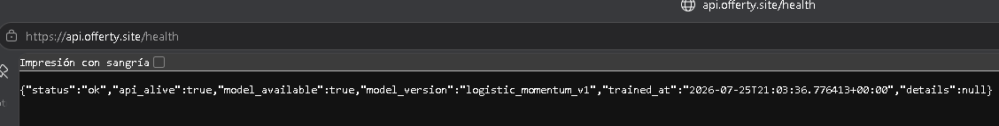

# actividad2-fastapi-finanzas-equipoJSC

-------------------------------------------------------------------------------------------------------------------------------
Integrantes

CLARA JOHANA ROBAYO ORTEGA : funcionabilidades de escala de datos y modelos
JAVIER PRADA VILLAMIZAR    : administracion del repositorio y acompañamiento en el desarrollo de los modelos
SANTIAGO ORJUELA           : Despliegue, ajustes de servidor y publicacion endpoint y acompañamieno de los modelos

-------------------------------------------------------------------------------------------------------------------------------


API de finanzas con FastAPI, datos cacheados localmente y predicción `up/down`, para tres activos financieros: BITCOIN - ORO Y DOLAR US.


## Acceso a la API publicada

La aplicación está desplegada en un servidor OVH y un dominio heredado en godaddy (Google no nos acepto las tarjetas de credito ni la de nequi) se accede mediante HTTPS:

- **URL base:** [https://api.offerty.site](https://api.offerty.site)
- **Swagger UI:** [https://api.offerty.site/docs](https://api.offerty.site/docs)
- **Estado del servicio:** [https://api.offerty.site/health](https://api.offerty.site/health)

Swagger UI permite explorar los endpoints, revisar sus esquemas y ejecutar solicitudes desde el navegador. El acceso HTTP se redirige automáticamente a HTTPS y el certificado TLS es administrado por el proxy inverso Caddy.

-------------------------------------------------------------------------------------------------------------------------------
# 1. Explicacion del flujo y de los procesos , el sistema generará un predicion up/down para el activo (oro,bitcoin,dolar) para el dia siguiente

• El sistema completo funciona así:

  CSV local
    ↓
  features_service.py
    ↓
  modelo logistic_momentum_v1
    ↓
  POST /predict
    ↓
  {"prediction": "up" o "down"}


  ### 1.1. Datos de entrada

  Los datos históricos están alojados en :

  data/raw/BTC-USD_5y.csv
  data/raw/GC=F_5y.csv
  data/raw/DX-Y.NYB_5y.csv

  Cada archivo contiene precios diarios descargados originalmente con yfinance cargados desde (dowload_data.py).

   #### La API primero intenta usar estos archivos locales. Por eso puede funcionar aunque no haya conexión a Internet.

  En la petición:

  {
    "symbol": "BTC-USD",
    "prediction_horizon": 1,
    "use_cached_data": true
  }

  use_cached_data: true significa que únicamente utilizará el CSV local.

  ### 1.2. Construcción de features (training)

  El archivo src/smart_portfolio_api/services/feature_service.py transforma los precios
  históricos en variables numéricas.

  Las features son:

  - close: precio de cierre actual.
  - return_1d: variación porcentual respecto al día anterior.
  - return_5d: variación porcentual respecto a hace cinco días.
  - ma_gap_5: distancia del precio actual frente al promedio móvil de cinco días.
  - ma_gap_20: distancia frente al promedio móvil de veinte días.
  - volatility_10: volatilidad calculada con los últimos diez retornos diarios.
  - volume_change_5d: cambio del volumen respecto a hace cinco días.

  Ejemplo conceptual:

  close = 100
  precio hace 1 día = 98

  return_1d = (100 / 98) - 1
  return_1d = 0.0204 = 2.04%

  Después se eliminan las primeras filas que no tienen suficientes datos para calcular medias,
  retornos o volatilidad.

  ### 1.3. Creación del objetivo (prediccion)

  Para entrenar el modelo se crea una columna llamada target:

  target = 1 si el precio futuro sube
  target = 0 si el precio futuro baja o no sube

  Con horizonte de un día:

  features["target"] = (close.shift(-1) > close).astype(int)

  Por ejemplo:

  Precio hoy       Precio mañana       target
  100              105                  1  -> up
  100              95                   0  -> down

  La API no devuelve target; esa columna solo se utiliza durante el entrenamiento.

  ### 1.4. como Entrenamos el modelo (train)

  El archivo src/smart_portfolio_api/services/model_service.py hace lo siguiente:

  1. Carga los datos locales de Bitcoin, oro y dólar.
  2. Construye las siete features para cada activo.
  3. Junta todos los datos.
  4. Divide cada activo aproximadamente en:
      - 80% para entrenamiento.
      - 20% para validación.

  5. Normaliza las features.
  6. Entrena un clasificador logístico.
  7. Calcula la métrica accuracy.
  8. Guarda el modelo y su metadata.

  Aunque se llama logistic_momentum_v1, no se utiliza la clase de Logistic Regression de una
  biblioteca externa. El algoritmo está implementado manualmente mediante:

  - pesos;
  - intercepto;
  - función sigmoide;
  - descenso por gradiente.

  El modelo calcula una puntuación matemática:

  z = intercepto + feature1 * peso1 + feature2 * peso2 + ...

  Luego convierte esa puntuación en una probabilidad:

  probability_up = 1 / (1 + exp(-z))

  ### 1.5. Cómo decide up o down

  La regla actual es:

  if probability_up >= 0.5:
      prediction = "up"
  else:
      prediction = "down"

  Por ejemplo:

  {
    "symbol": "BTC-USD",
    "prediction": "up",
    "probability_up": 0.63,
    "model_version": "logistic_momentum_v1",
    "prediction_horizon": "next_day"
  }

  Esto significa que el modelo estima una probabilidad matemática de 63% de subida y, como es
  mayor o igual a 50%, devuelve up.

  probability_up no significa certeza. Es la confianza interna del modelo, no una garantía de que
  el mercado subirá.

  ### 1.6. Qué ocurre cuando llamamos a /predict

  La ruta está en src/smart_portfolio_api/routers/predict.py.

  El flujo es:

  1. FastAPI recibe el JSON.
  2. Pydantic valida:
      - que exista symbol;
      - que prediction_horizon sea 1;
      - que no existan campos adicionales.

  3. Se carga el modelo desde artifacts/model.joblib.
  4. Se carga el histórico del símbolo.
  5. Se calculan nuevamente las features.
  6. Se toma la última fila disponible.
  7. El modelo calcula probability_up.
  8. Se devuelve up o down.

  Si model.joblib no existiera, el sistema intentaría entrenar el modelo automáticamente usando
  los CSV locales.

  ### 1.7. Para qué sirve model.joblib

  Este archivo contiene el modelo entrenado:

  artifacts/model.joblib

  Incluye:

  - nombres de las features;
  - medias utilizadas para normalizar;
  - desviaciones estándar;
  - pesos aprendidos;
  - intercepto;
  - versión;
  - fecha de entrenamiento;
  - activos usados;
  - métrica;
  - horizonte de predicción.

  Así, la API no tiene que entrenar el modelo en cada petición.

  ### 1.8. Para qué sirve model_metadata.json

  Este archivo contiene información legible sobre el modelo:

  artifacts/model_metadata.json

  La ruta:

  GET /model/metadata

  devuelve datos como:

  {
    "model_version": "logistic_momentum_v1",
    "trained_at": "...",
    "symbols_used": ["BTC-USD", "GC=F", "DX-Y.NYB"],
    "metric_name": "accuracy",
    "metric_value": 0.50,
    "prediction_horizon": 1,
    "feature_columns": [
      "close",
      "return_1d",
      "return_5d",
      "ma_gap_5",
      "ma_gap_20",
      "volatility_10",
      "volume_change_5d"
    ]
  }

  La metadata permite saber qué modelo se está utilizando sin abrir el archivo serializado.

  ### 1.9. Como se hicieron las pruebas (test)

  Las pruebas están en tests/test_api.py.

  No prueban solamente funciones aisladas. Levantan temporalmente la API con Uvicorn:

  inicia servidor
    ↓
  envía peticiones HTTP reales
    ↓
  verifica respuestas
    ↓
  apaga servidor

  Se prueban estos endpoints:

  GET /health

  Comprueba que la API está viva y que el modelo puede cargarse.

  GET /market-data/BTC-USD

  Comprueba que se leen los datos locales y se generan features.

  GET /model/metadata

  Comprueba que existe la información del modelo y que contiene los campos esperados.

  POST /predict

  Comprueba que la predicción:

  - responde correctamente;
  - pertenece a up o down;
  - entrega una probabilidad entre 0 y 1;
  - usa el horizonte next_day.

  ### 1.10. Qué significa el comando de pruebas

  poetry run python -m unittest discover -s tests -p 'test_*.py'

  Cada parte significa:

  - poetry run: ejecuta el comando utilizando el entorno virtual y dependencias administradas por
    Poetry.

  - python -m unittest: ejecuta el módulo estándar de pruebas de Python.
  - discover: busca pruebas automáticamente.
  - -s tests: busca dentro de la carpeta tests.
  - -p 'test_*.py': utiliza archivos cuyo nombre empiece por test_ y termine en .py.

  En este proyecto encuentra:

  tests/test_api.py

  Y ejecuta sus cuatro pruebas de integración.

  ### 1.11 Informacion importante sobre el modelo actual

  La arquitectura cumple el flujo de predicción up/down

  versión 1:

  - Solo predice el día siguiente.
  - Solo utiliza Bitcoin, oro y dólar.

  En resumen, la predicción actualmente encaja así:

  POST /predict
    ↓
  validación Pydantic
    ↓
  carga de model.joblib
    ↓
  carga de CSV local
    ↓
  cálculo de las 7 features
    ↓
  cálculo de probability_up
    ↓
  umbral 0.5
    ↓
  up/down


-------------------------------------------------------------------------------------------------------------------------------

### 2. Funcionalidades disponibles

- Consultar el estado de la API y la disponibilidad del modelo con `GET /health`.
- Obtener precios recientes e indicadores calculados con `GET /market-data/{symbol}`.
- Estimar si el precio del siguiente día subirá o bajará con `POST /predict`.
- Consultar versión, entrenamiento, métrica y variables del modelo con `GET /model/metadata`.
- Generar una gráfica PNG del histórico anual con `GET /charts/history/{ticker}`.

La API reconoce Bitcoin (`BTC-USD`), futuros del oro (`GC=F`) e índice del dólar (`DX-Y.NYB`), además de alias como `BTC`, `GOLD` y `DXY`.

Ejemplo de predicción por comando desde la terminal:


curl -X POST "https://api.offerty.site/predict" \
  -H "Content-Type: application/json" \
  -d '{
    "symbol": "BTC-USD",
    "prediction_horizon": 1,
    "use_cached_data": true
  }'


Respuesta esperada:

json
{
  "symbol": "BTC-USD",
  "prediction": "up",
  "probability_up": 0.52,
  "model_version": "logistic_momentum_v1",
  "prediction_horizon": "next_day"
}


## Resumen

El proyecto expone una API liberada para operar con tres activos:

- Bitcoin: `BTC`, `BTC-USD`, `BITCOIN` → `BTC-USD`
- Oro: `GOLD`, `XAU`, `GC=F` → `GC=F`
- Dólar: `DOLLAR`, `DXY`, `DX-Y.NYB` → `DX-Y.NYB`

La API:

- sirve un endpoint raíz en `/`
- sirve documentación Swagger en `/docs`
- ofrece `health`, datos de mercado, predicción y metadata del modelo
- usa datos locales en `data/raw/` como fuente principal
- puede recurrir a `yfinance` si se habilita el uso de red y no existe caché local
- entrena un clasificador simple `up/down` con probabilidades


-------------------------------------------------------------------------------------------------------------------------------

## 3. Estructura del proyecto


actividad2-fastapi-finanzas-equipoJSC/
├── artifacts/
│   ├── model.joblib
│   └── model_metadata.json
├── data/
│   ├── raw/
│   └── processed/
├── src/
│   └── smart_portfolio_api/
│       ├── __init__.py
│       ├── download_data.py
│       ├── main.py
│       ├── schemas.py
│       ├── routers/
│       │   ├── health.py
│       │   ├── market_data.py
│       │   ├── model.py
│       │   ├── predict.py
│       │   └── charts.py
│       └── services/
│           ├── feature_service.py
│           ├── market_data_service.py
│           ├── model_service.py
│           └── yahoo_services.py
├── tests/
├── Dockerfile
├── pyproject.toml
├── poetry.lock
├── README.md
├── TEAM.md
└── .gitignore

-------------------------------------------------------------------------------------------------------------------------------
## 4. Instalación y replicacion

 Para copiar el proyecto desde GitHub:
 - en el editor de codigo favorito, crea la carpeta donde se alojara el proyecto, luego abre una ventana de terminal y ejecuta:
  git clone https://github.com/dinamica365/actividad2-fastapi-finanzas-equipoJSC.git
  luego has:   cd actividad2-fastapi-finanzas-equipoJSC y estaras ubicado en la raiz del proyecto


poetry install:  este comando replica e instala todas las dependencias en la maquina local

## 4.1. Primera Ejecución local

poetry run python -m smart_portfolio_api.main


La documentación Swagger queda disponible en la siguiente url local de la maquina host:  http://127.0.0.1:8000/docs


## 4.2. Endpoints

### `GET /health`

Verifica que la API esté viva y que el modelo esté disponible.

Respuesta esperada:

{
  "status": "ok",
  "api_alive": true,
  "model_available": true,
  "model_version": "logistic_momentum_v1",
  "trained_at": "2026-07-25T21:03:36.776413+00:00",
  "details": null
}


Si el modelo no puede cargarse, la respuesta cambia a `status: "degraded"` y `model_available: false`.

### `GET /`

Devuelve un mensaje simple para confirmar que la API arrancó.

Ejemplo:

{
  "message": "SmartPortfolio API is running"
}


### `GET /market-data/{symbol}`

Devuelve datos recientes y features procesadas para un activo.

Parámetros:

- `symbol`: símbolo del activo
- `use_cached_data`: `true` por defecto; si es `false`, permite usar `yfinance` si no existe caché local

Ejemplo:


curl "http://127.0.0.1:8000/market-data/BTC-USD?use_cached_data=true"


Ejemplo de respuesta:


{
  "symbol": "BTC-USD",
  "source": "cache",
  "records": [
    {
      "date": "2026-07-24",
      "close": 117000.12,
      "return_1d": 0.0123,
      "return_5d": 0.0345,
      "ma_gap_5": 0.0081,
      "ma_gap_20": 0.0217,
      "volatility_10": 0.0184,
      "volume_change_5d": 0.0912
    }
  ]
}


### `POST /predict`

Recibe un símbolo y parámetros de inferencia, y retorna una predicción `up/down`.

Contrato de entrada:


{
  "symbol": "BTC-USD",
  "prediction_horizon": 1,
  "use_cached_data": true
}


Campos:

- `symbol`: símbolo del activo
- `prediction_horizon`: horizonte de predicción en días
- `use_cached_data`: si es `true`, la API solo usa datos locales

Respuesta esperada:


{
  "symbol": "BTC-USD",
  "prediction": "up",
  "probability_up": 0.63,
  "model_version": "logistic_momentum_v1",
  "prediction_horizon": "next_day"
}


Notas:

- el modelo actual soporta `prediction_horizon = 1`
- la salida `prediction` solo puede ser `up` o `down`
- `probability_up` es un valor entre `0.0` y `1.0`

### `GET /model/metadata`

Retorna la metadata local del modelo.

Ejemplo de respuesta:


{
  "model_version": "logistic_momentum_v1",
  "trained_at": "2026-07-25T21:03:36.776413+00:00",
  "symbols_used": ["BTC-USD", "GC=F", "DX-Y.NYB"],
  "metric_name": "accuracy",
  "metric_value": 0.5066,
  "prediction_horizon": 1,
  "feature_columns": [
    "close",
    "return_1d",
    "return_5d",
    "ma_gap_5",
    "ma_gap_20",
    "volatility_10",
    "volume_change_5d"
  ]
}


### `GET /charts/history/{ticker}`

Devuelve una imagen PNG con el histórico de cierres de un activo.

Ejemplo:


curl -o BTC-USD.png "http://127.0.0.1:8000/charts/history/BTC-USD"


## 4.3. Símbolos soportados

Activos financieros seleccionadoss a estos alias:

- `BTC`, `BTC-USD`, `BITCOIN` -> `BTC-USD`
- `GOLD`, `XAU`, `GC=F` -> `GC=F`
- `DOLLAR`, `DXY`, `DX-Y.NYB` -> `DX-Y.NYB`

## 4.4. Datos locales y reproducibilidad

La API no depende exclusivamente de internet para funcionar.

- Los CSV locales están en `data/raw/`
- La inferencia usa primero la caché local
- Si `use_cached_data=false`, la API puede consultar `yfinance` y guardar el resultado localmente
- Si ya hay datos locales, la API funciona sin red

Los archivos esperados para la evaluación son:

- `data/raw/BTC-USD_5y.csv`
- `data/raw/GC=F_5y.csv`
- `data/raw/DX-Y.NYB_5y.csv`

## 4.5. Ingesta de datos

El módulo `download_data.py` permite descargar históricos con `yfinance`:


poetry run python -m smart_portfolio_api.download_data BTC-USD --period 5y
poetry run python -m smart_portfolio_api.download_data "GC=F" --period 5y
poetry run python -m smart_portfolio_api.download_data DX-Y.NYB --period 5y


Parámetros:

- `--period`: ventana histórica a descargar, por ejemplo `1y`, `5y` o `max`
- `--output`: ruta de salida personalizada

Ejemplo:


poetry run python -m smart_portfolio_api.download_data BTC-USD --period 5y --output data/raw/BTC-USD_5y.csv


## 4.6. Modelo

El modelo actual es un clasificador simple `logistic_momentum_v1` entrenado con features derivadas de precios y volumen.

Features usadas:

- `close`
- `return_1d`
- `return_5d`
- `ma_gap_5`
- `ma_gap_20`
- `volatility_10`
- `volume_change_5d`

La metadata se guarda en `artifacts/model_metadata.json` y el modelo serializado en `artifacts/model.joblib`.

## 4.7. Pruebas

Las pruebas de integración están en `tests/test_api.py` y arrancan un servidor temporal de Uvicorn para validar:

- `GET /health`
- `GET /market-data/{symbol}`
- `GET /model/metadata`
- `POST /predict`

Ejecutar pruebas:


poetry run python -m unittest discover -s tests -p 'test_*.py'


## 4.8. Docker

Construir y ejecutar la imagen localmente:


docker build -t smart-portfolio-api .
docker run --rm -p 8080:8080 smart-portfolio-api


Abrir `http://localhost:8080/docs` o comprobar el servicio con:


Invoke-RestMethod http://localhost:8080/health

-------------------------------------------------------------------------------------------------------------------------------
## 5. Despliegue en Google Cloud Run

Cloud Run construye el `Dockerfile`, crea una imagen en Artifact Registry y ejecuta el contenedor como un servicio administrado. Se necesita un proyecto de Google Cloud con facturación activa, [Google Cloud CLI](https://cloud.google.com/sdk/docs/install) y permisos para Cloud Run, Cloud Build y Artifact Registry.

### 5.1. Configurar el proyecto

Iniciar sesión, definir los valores del despliegue y habilitar las APIs necesarias:


gcloud auth login

$PROJECT_ID = "mi-proyecto-gcp"
$REGION = "us-central1"
$SERVICE = "smart-portfolio-api"

gcloud config set project $PROJECT_ID
gcloud services enable run.googleapis.com cloudbuild.googleapis.com artifactregistry.googleapis.com


Reemplazar `mi-proyecto-gcp` por el identificador real del proyecto, no por su nombre visible.

### 5.2. Construir y publicar

Ejecutar desde la raíz del repositorio, donde está el `Dockerfile`:


gcloud run deploy $SERVICE `
  --source . `
  --region $REGION `
  --port 8080 `
  --memory 1Gi `
  --allow-unauthenticated


`--source .` envía el código a Cloud Build. Cloud Run inyecta la variable `PORT`; el contenedor ya escucha en `0.0.0.0:${PORT}`. `--allow-unauthenticated` publica la API en Internet. Para un servicio privado, usar `--no-allow-unauthenticated` y configurar permisos IAM.

### 5.3. Obtener la URL y probar el contenedor


$SERVICE_URL = gcloud run services describe $SERVICE `
  --region $REGION `
  --format="value(status.url)"

Invoke-RestMethod "$SERVICE_URL/health"
Invoke-RestMethod "$SERVICE_URL/model/metadata"

$BODY = @{
  symbol = "BTC-USD"
  prediction_horizon = 1
  use_cached_data = $true
} | ConvertTo-Json

Invoke-RestMethod `
  -Method Post `
  -Uri "$SERVICE_URL/predict" `
  -ContentType "application/json" `
  -Body $BODY


La documentación interactiva queda disponible en `$SERVICE_URL/docs`.

### 5.4. Publicar actualizaciones y consultar registros

Después de cambiar el código, ejecutar nuevamente el comando `gcloud run deploy`; Cloud Run creará una revisión inmutable. Para consultar los registros recientes:

```powershell
gcloud run services logs read $SERVICE --region $REGION --limit 50
```

### 5.5. Datos y modelos en Cloud Run

Durante la construcción, `data/` y `artifacts/` se copian dentro de la imagen. Cada revisión contiene una instantánea de los CSV y de `model.joblib`, por lo que las predicciones con `use_cached_data=true` no necesitan consultar Yahoo Finance. Para actualizar esos archivos se deben regenerar localmente, validar el modelo y desplegar una nueva revisión.

Los archivos creados durante la ejecución del contenedor son temporales y pueden desaparecer cuando Cloud Run detiene la instancia. No se deben usar los endpoints HTTP como mecanismo permanente de actualización. Para automatizar el proceso, usar un Cloud Run Job programado para descargar y entrenar, guardar CSV y modelos en Cloud Storage y hacer que la API cargue artefactos versionados. Consultar el [contrato del contenedor](https://cloud.google.com/run/docs/container-contract) y la [guía oficial de despliegue](https://cloud.google.com/run/docs/deploying-source-code).

## 5.6. Notas de implementación

- `GET /docs` está habilitado por defecto por FastAPI.
- El modelo se regenera automáticamente desde caché local si el artefacto no existe o no se puede cargar.
- El endpoint de predicción responde en formato validado por Pydantic, no con estructuras libres.
